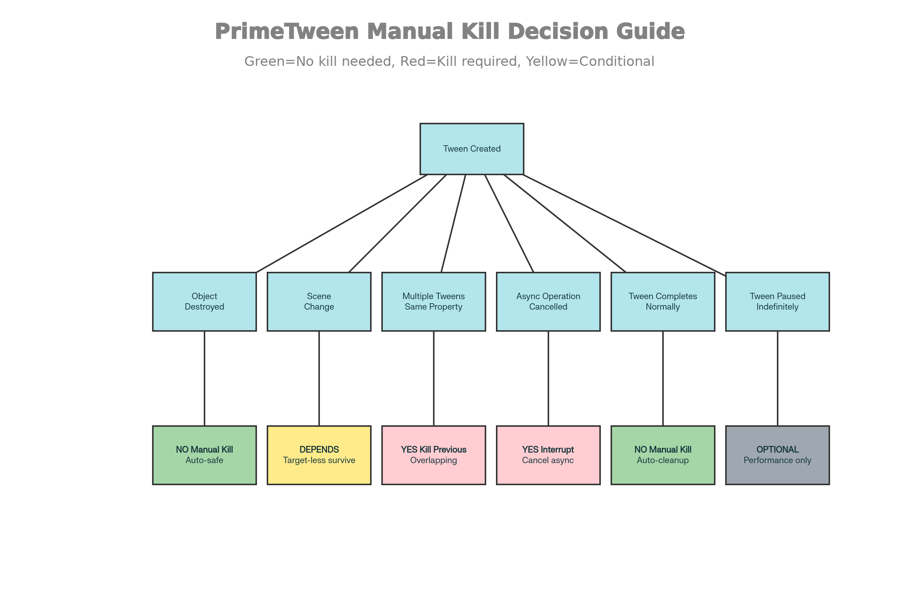

Các Tình Huống KHÔNG Cần Manual Kill (Tự Động Xử Lý)
----------------------------------------------------

1\. Object Bị Destroy - Tuyệt Đối An Toàn
-----------------------------------------

csharp

`// 100% an toàn - PrimeTween tự động detect  void  Start()  {   Tween.MoveX(transform,  100,  2);  }    void  OnDestroy()  {    // Không cần kill - PrimeTween đã xử lý  }  `

PrimeTween sẽ tự động dừng khi target destroy, không có null reference nào. Điều này là tính năng mặc định, không cần enable cái gì.​

2\. Tween Hoàn Thành Bình Thường
--------------------------------

csharp

`// Không cần kill - tween tự cleanup sau OnComplete  Tween.MoveX(transform,  100,  1)    .OnComplete(()  => Debug.Log("Done!"));  `

Khi tween hoàn thành, PrimeTween tự động release slot từ object pool, không có leak.​

3\. Object Không Có Target (Target-less Tweens)
-----------------------------------------------

csharp

`// Delay mà không cần target - an toàn qua scene change  Tween.Delay(2,  ()  =>  {   PersistentManager.Save();  });  `

Tweens mà không liên kết target object sẽ vẫn chạy ngay cả sau scene unload, nên important logic không bị interrupt.​

* * * * *

Tình Huống PHẢI Manual Kill (3 Trường Hợp Cụ Thể)
-------------------------------------------------

Trường Hợp 1: Multiple Overlapping Tweens - Cùng Property
---------------------------------------------------------

Problem: Nếu tạo nhiều tweens trên cùng property mà không kill cái cũ, chúng sẽ chạy song song và gây conflict:​

csharp

`// ❌ PROBLEM: Cả hai tweens chạy, conflict nhau  void  OnMouseDown()  {   Tween.ScaleX(transform,  2,  1);  // Tween #1: Scale từ 1 → 2  }    void  OnMouseUp()  {   Tween.ScaleX(transform,  1,  1);  // Tween #2: Scale từ 1 → 1 (conflict!)  }  // Kết quả: ScaleX bị update bởi cả hai tweens, behavior không predictable  `

Solution: Dùng seamless overwrite - tạo tween mới sẽ tự động replace cái cũ:

csharp

`// ✅ GOOD: Seamless overwrite  void  OnMouseDown()  {   Tween.ScaleX(transform,  2,  1);  // Tween #1  }    void  OnMouseUp()  {   Tween.ScaleX(transform,  1,  1);  // Tween #2: tự động kill Tween #1  }  `

Hoặc manual kill nếu cần control rõ ràng:

csharp

`private  Tween _scaleTween;    void  OnMouseDown()  {   _scaleTween.Stop();  // Kill previous   _scaleTween = Tween.ScaleX(transform,  2,  1);  }    void  OnMouseUp()  {   _scaleTween.Stop();  // Kill previous   _scaleTween = Tween.ScaleX(transform,  1,  1);  }  `

Chi phí: Nếu không kill, pool slot tiếp tục update mỗi frame, lãng phí CPU. Với hàng chục tweens tương tự, có thể cảm nhận được performance drop.​

Trường Hợp 2: Async Operation Bị Cancel - Cần Interrupt
-------------------------------------------------------

Problem: Nếu dùng PrimeTween với async/await và object bị despawn trước tween hoàn thành:

csharp

`// ❌ PROBLEM: Tween vẫn chạy nếu object despawn  async  Task  AnimateSpawner(GameObject spawnedEntity)  {    await Tween.MoveX(spawnedEntity.transform,  10,  2);    await Tween.ScaleY(spawnedEntity.transform,  2,  1);    // Nếu spawnedEntity despawn trước bước này, async task vẫn expect  }    void  DespawnEntity(GameObject entity)  {    Destroy(entity);  // Async method vẫn chạy!  }  `

Solution: Manual interrupt trước despawn:​

csharp

`private  Tween _animTween;  private  Sequence _animSeq;    async  Task  AnimateSpawner(GameObject spawnedEntity)  {   _animSeq = Sequence.Create()    .Chain(Tween.MoveX(spawnedEntity.transform,  10,  2))    .Chain(Tween.ScaleY(spawnedEntity.transform,  2,  1));     await _animSeq;  }    void  DespawnEntity(GameObject entity)  {   _animSeq.Stop();  // MUST interrupt before destroy    Destroy(entity);  }  `

Tại sao cần: Không interrupt sẽ khiến async method bị "hanging" - nó vẫn expect tween hoàn thành nhưng target đã gone. Có thể dẫn tới task completion handlers execute trên object đã destroy.​

Trường Hợp 3: Paused Tweens - Optionally Kill Để Tiết Kiệm
----------------------------------------------------------

Problem: Tween bị pause mà không kill sẽ vẫn consume pool slot:

csharp

`private  Tween _idleTween;    void  Start()  {    // Pause animation khi enter idle state   _idleTween = Tween.Rotation(transform,  new  Vector3(0,  360,  0),  5,  cycles:  -1);   _idleTween.Pause();  }    void  OnAnimationStart()  {   _idleTween.Pause();  // Vẫn chiếm pool slot mỗi frame!  }  `

Solution: Kill nếu không sắp resume lại:

csharp

`void  OnAnimationStart()  {   _idleTween.Stop();  // Kill để free pool slot    // hoặc    if  (!_idleTween.isAlive)  {    // Đã được auto-kill, safe to ignore    }  }  `

Chi phí: Mỗi paused tween vẫn được update bởi PrimeTweenManager mỗi frame, tuy không tính animation progress nhưng vẫn có overhead. Với hàng trăm paused tweens, có thể thấy ~10-20% CPU usage.​

* * * * *

Tóm Tắt: Kill vs Auto-Management
--------------------------------

| Tình Huống | Manual Kill Cần Thiết? | Lý Do |
| --- | --- | --- |
| Object destroy | ❌ Không | Auto-safe checking mỗi frame |
| Tween hoàn thành | ❌ Không | Auto-cleanup từ pool |
| Target-less delay | ❌ Không | Survive scene change tự động |
| Multiple tweens cùng property | ✅ Có | Seamless overwrite hoặc manual kill |
| Async cancelled | ✅ Có | Cần interrupt trước despawn |
| Paused indefinitely | ⚠️ Optional | Performance: tiếp tục chiếm pool slot |

* * * * *

Best Practices
--------------

1\. Để PrimeTween tự quản lý - Thường chỉ tạo tweens, không cần worry:

csharp

`Tween.MoveX(transform,  100,  1);  // Set and forget  Tween.Scale(transform,  2,  1).OnComplete(()  => Debug.Log("Done"));  `

2\. Kill khi có overlapping - Để seamless overwrite hoạt động:

csharp

`// Cách 1: Rely on seamless overwrite (recommended)  Tween.ScaleX(transform,  2,  0.5f);  // ... later  Tween.ScaleX(transform,  1,  0.5f);  // Tự kill cái trước    // Cách 2: Manual control  _tween.Stop();  _tween = Tween.ScaleX(transform,  2,  0.5f);  `

3\. Interrupt async tasks - Trước khi despawn:

csharp

`void  OnDestroy()  {   _sequence?.Stop();  // Safe null-conditional  }  `

4\. Inspect paused tweens - Dùng PrimeTweenManager debug panel để thấy có bao nhiêu paused tweens, nếu quá nhiều thì kill chúng.​

Kết luận: Tuyên bố "hoàn toàn không cần manual kill" là hơi quá lạc quan. Trong thực tế, ~80% trường hợp bạn không cần, nhưng ~20% edge cases (overlapping tweens, async cancellation, long-running paused tweens) vẫn cần manual intervention để code behave correctly.​

</generate

1.  <https://www.reddit.com/r/Unity3D/comments/16vdwmn/just_launched_primetween_my_highperformance_tween/>
2.  <https://github.com/KyryloKuzyk/PrimeTween/discussions/4>
3.  <https://github.com/KyryloKuzyk/PrimeTween/discussions/10>
4.  <https://www.youtube.com/watch?v=DEkgi2ufrUA>
5.  <https://jasper-jzh.github.io/PrimeTween%E5%AD%A6%E4%B9%A0%E7%AC%94%E8%AE%B0/index.html>
6.  <https://stackoverflow.com/questions/44485394/gsap-should-i-kill-a-tween-before-overriding-it>
7.  <https://github.com/KyryloKuzyk/PrimeTween/discussions/3>
8.  <https://www.reddit.com/r/godot/comments/sch3gd/why_this_tween_isnt_stopping/>
9.  <https://www.reddit.com/r/Unity3D/comments/1dooi5t/dotween_best_practice_for_killing_a_tweensequence/>
10. <https://assetstore.unity.com/packages/tools/animation/primetween-high-performance-animations-and-sequences-252960>
11. <https://devforum.roblox.com/t/how-am-i-supposed-to-wait-for-a-tween-to-complete-and-stop-when-another-value-is-false-correctly/1837234>
12. <https://gsap.com/community/forums/topic/21598-overlapping-tweens-and-repeat-problem/>
13. <https://stackoverflow.com/questions/58456365/how-to-chain-async-tasks-with-a-cancellationtoken>
14. <https://github.com/KyryloKuzyk/PrimeTween/discussions/6>
15. <https://mitesh1612.github.io/blog/2022/01/20/cancellation-tokens>
16. <https://devforum.roblox.com/t/bit-of-a-steep-one-how-would-i-interpolate-blend-tweens-together/2863021>
17. <https://devblogs.microsoft.com/premier-developer/recommended-patterns-for-cancellationtoken/>
18. <https://forum.godotengine.org/t/multiple-tweens-problem/86662>