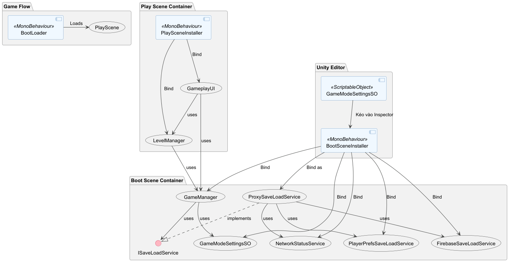

# Ví dụ Reflex cho Game Tower Defense

Đây là một ví dụ hoàn chỉnh minh họa cách sử dụng framework Reflex DI (Dependency Injection) để cấu trúc một game Tower Defense đơn giản, với kịch bản chuyển từ scene khởi động (`BootScene`) sang scene chơi game (`PlayScene`).

## Mục Đích

Ví dụ này minh họa các khái niệm nâng cao và rất thực tế:
- **Proxy Pattern**: Cách tạo một lớp "ủy quyền" để quản lý và chuyển đổi giữa các dịch vụ khác nhau lúc runtime.
- **Ghi đè Binding (Binding Overriding)**: Điều gì xảy ra khi bạn bind cùng một dịch vụ ở các cấp container khác nhau.
- **Lập trình theo Interface**: Cách định nghĩa các "hợp đồng" (interface) và triển khai chúng, giúp code trở nên linh hoạt và dễ thay thế.
- **Tách biệt logic**: Logic game (`GameManager`) hoàn toàn không biết về trạng thái mạng hay cơ chế lưu trữ nào đang được sử dụng.

---

## Cấu Trúc Tổng Quan (PlantUML Diagram)

<p align="center">
  
</p>

## Các Khái Niệm Cốt Lõi Của Reflex Trong Ví Dụ Này

### 1. Proxy Pattern cho Logic Runtime

Đây là một kỹ thuật cực kỳ mạnh mẽ để xử lý các logic thay đổi trong lúc game đang chạy.

- **Vấn đề**: Chúng ta muốn game tự động lưu lên server khi có mạng, và chuyển về lưu cục bộ khi mất mạng. `GameManager` không nên phải chứa logic `if (isOnline) { ... } else { ... }` này.
- **Giải pháp: Proxy Pattern**
    1.  **Tạo một lớp Proxy**: Chúng ta tạo `ProxySaveLoadService` cũng triển khai `ISaveLoadService`.
    2.  **Inject tất cả vào Proxy**: `ProxySaveLoadService` sẽ yêu cầu tất cả các dependency mà nó cần: `NetworkStatusService`, `FirebaseSaveLoadService`, và `PlayerPrefsSaveLoadService`.
    3.  **Ủy quyền (Delegate)**: Khi `GameManager` gọi `Save()` trên `ISaveLoadService`, thực chất nó đang gọi đến `ProxySaveLoadService`. Lớp proxy này sẽ kiểm tra trạng thái mạng và quyết định gọi `Save()` của dịch vụ online hay offline.
- **Lợi ích**: Logic game (`GameManager`) vẫn "trong sạch", không biết gì về mạng hay có bao nhiêu cách lưu trữ. Toàn bộ logic quyết định được gói gọn trong `ProxySaveLoadService`.

### 2. Ghi đè Binding (Binding Overriding)

Đây là một tính năng mạnh mẽ của các hệ thống DI phân cấp, cho phép container con "che" (hide) hoặc "ghi đè" (override) các binding từ container cha.

- **Kịch bản**: Điều gì xảy ra nếu bạn bind `ISaveLoadService` trong cả `ProjectInstaller` và `BootSceneInstaller`?
    ```csharp
    // Trong ProjectInstaller.cs (VÍ DỤ GIẢ ĐỊNH)
    builder.AddSingleton(typeof(FirebaseSaveLoadService), typeof(ISaveLoadService));

    // Trong BootSceneInstaller.cs (VÍ DỤ GIẢ ĐỊNH)
    builder.AddSingleton(typeof(PlayerPrefsSaveLoadService), typeof(ISaveLoadService));
    ```
- **Kết quả**: Sẽ có **hai** instance dịch vụ khác nhau được tạo ra. Khi một dependency được yêu cầu từ `BootSceneContainer`, nó sẽ tìm trong chính nó trước. Vì nó tìm thấy `PlayerPrefsSaveLoadService`, nó sẽ sử dụng ngay lập tức và **không hỏi `ProjectContainer` nữa**.
- **Ứng dụng thực tế**: Kỹ thuật này rất hữu ích cho **testing** (dùng `MockSaveService` trong scene test để ghi đè `RealSaveService` từ project) hoặc tạo ra các **hành vi đặc thù cho từng scene**.

### 3. Lập trình theo Interface (Programming to Interface)

- **Vấn đề**: Nếu `GameManager` trực tiếp sử dụng một lớp lưu trữ cụ thể, nó sẽ bị "ràng buộc cứng".
- **Giải pháp**: Chúng ta định nghĩa một "hợp đồng" là `ISaveLoadService`. `GameManager` chỉ cần biết đến và sử dụng interface này. Trong `Installer`, chúng ta chỉ định `ProxySaveLoadService` là triển khai cho interface đó.

### 4. Constructor Injection và Attribute Injection

- **Constructor Injection (Không `[Inject]`)**: Dùng cho các lớp C# thông thường (`GameManager`, `ProxySaveLoadService`...). Reflex tự động tìm và điền các dependency vào hàm dựng.
- **Attribute Injection (`[Inject]`)**: Dùng cho các `MonoBehaviour` (`GameplayUI`) vì chúng ta không kiểm soát việc tạo ra chúng.

---

## Cấu Trúc Thư Mục (Cập nhật)

Đây là cấu trúc file hoàn chỉnh của ví dụ này:

```
Assets/TowerDefence_Vsquad/Scripts/ReflexExample/
├── Boot/
│   ├── BootLoader.cs           # Logic tải scene và thiết lập container cha-con.
│   └── BootSceneInstaller.cs     # Installer cho BootScene, đọc cấu hình và bind các dịch vụ chính.
│
├── Play/
│   ├── GameplayUI.cs           # MonoBehaviour để hiển thị UI và nhận input.
│   ├── LevelManager.cs         # Logic cụ thể của màn chơi.
│   └── PlaySceneInstaller.cs     # Installer cho PlayScene, bind các dịch vụ của màn chơi.
│
├── Project/
│   ├── Configuration/
│   │   └── GameModeSettingsSO.cs   # ScriptableObject để chứa dữ liệu cấu hình.
│   │
│   ├── Core/
│   │   └── GameManager.cs          # Quản lý trạng thái game (mạng, tiền).
│   │
│   ├── Services/
│   │   ├── NetworkStatusService.cs # Dịch vụ kiểm tra trạng thái mạng.
│   │   └── SaveLoad/
│   │       ├── ISaveLoadService.cs     # Interface (hợp đồng) cho dịch vụ lưu/tải.
│   │       ├── ProxySaveLoadService.cs # Lớp Proxy "thông minh" để chọn dịch vụ lưu/tải.
│   │       └── Implementations/
│   │           ├── FirebaseSaveLoadService.cs  # Triển khai (giả) lưu lên cloud.
│   │           └── PlayerPrefsSaveLoadService.cs # Triển khai lưu cục bộ.
│   │
│   └── ProjectInstaller.cs         # Installer toàn cục (trống trong ví dụ này).
│
└── README.md                     # File hướng dẫn này.
```

---

## Hướng Dẫn Cài Đặt và Chạy Thử
(Các bước cài đặt không thay đổi)

### Bước 1: Cấu hình ScriptableObjects
Tạo các asset `NormalMode` và `HardMode` từ menu **Create -> TowerDefence -> Game Mode Settings**.

### Bước 2: Cấu hình Boot Scene
1.  Tạo scene `BootScene` và thêm `SceneScope` vào đó.
2.  Gắn component `BootSceneInstaller` vào `SceneScope`.
3.  Trên component `BootSceneInstaller`, kéo `ScriptableObject` chế độ chơi vào ô **Selected Game Mode**.
4.  Thêm `BootLoaderObject` với component `BootLoader`.
5.  Thêm `BootScene` và `PlayScene` vào **Build Settings**.

### Bước 3: Chạy Thử
1.  Mở `BootScene` và nhấn **Play**.
2.  **Thử nghiệm Online**: Đảm bảo máy bạn có kết nối internet. Khi bạn tương tác với game, bạn sẽ thấy các log màu cam từ `[FirebaseSaveLoadService]` trong Console.
3.  **Thử nghiệm Offline**: Tắt Wifi/rút dây mạng của máy bạn. Khi bạn tương tác với game, bạn sẽ thấy các log từ `[PlayerPrefsSaveLoadService]`.
4.  `GameManager` vẫn hoạt động bình thường và không hề biết về sự thay đổi này.
