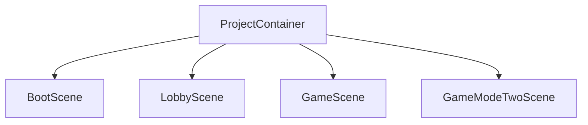
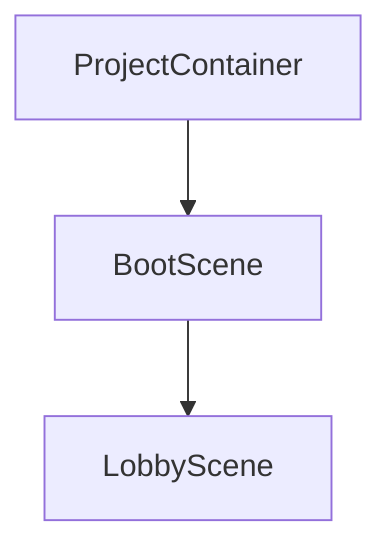

<div align=center>

<p align="center">
  
</p>

### Thư viện dependency injection cực nhanh, tối giản nhưng đầy đủ cho <a href="https://unity.com/">Unity</a>

Reflex là một framework [Dependency Injection](https://stackify.com/dependency-injection/) (DI - Tiêm phụ thuộc) cho [Unity](https://unity.com/). Nó giúp các lớp của bạn độc lập với các dependency (phụ thuộc) của chúng, mang lại khả năng phân tách trách nhiệm (separation of concerns) tốt hơn. Reflex đạt được điều này bằng cách tách rời việc sử dụng một đối tượng khỏi việc tạo ra nó. Điều này giúp bạn tuân theo các nguyên tắc đảo ngược phụ thuộc (dependency inversion) và trách nhiệm đơn nhất (single responsibility) của SOLID, làm cho dự án của bạn **dễ đọc, dễ kiểm thử và dễ mở rộng hơn.**

[](https://discord.gg/XM47TsGScH)
[](https://opensource.org/licenses/MIT)

[](http://makeapullrequest.com)
[](https://github.com/gustavopsantos/reflex/releases)
[](https://openupm.com/packages/com.gustavopsantos.reflex/)
[](https://unity3d.com/pt/get-unity/download/archive)

</div>

## ⚠️ Lưu Ý Khi Sử Dụng: Persistent Objects + Scoped Dependencies

### 🔴 Vấn Đề: Architecture Mismatch

Khi bạn có **persistent objects** (tồn tại lâu dài, không bị destroy) cần sử dụng **scoped dependencies** (dependencies có lifecycle ngắn hơn, bị recreate), Reflex không tự động re-inject:

#### **Ví dụ:**

```csharp
// GameStateMachine: Persistent (DontDestroyOnLoad)
public class GameStateMachine : MonoBehaviour
{
    public GameState_Lobby State_Lobby { get; private set; }
    
    void InitializeAllStates()
    {
        // Tạo 1 lần duy nhất khi game start
        State_Lobby = new GameState_Lobby(this);
    }
}

// GameState_Lobby: Persistent (được tạo 1 lần)
public class GameState_Lobby : FSM_State
{
    [Inject] private EventBusLobby _eventBusLobby; // ❌ Scoped - bị stale khi scene reload
    [Inject] private PopupManager _popupManager;   // ❌ Scoped - bị stale khi scene reload
}

// LobbySceneInstaller: Scene Scope
public class LobbySceneInstaller : MonoBehaviour, IInstaller
{
    public void InstallBindings(ContainerBuilder builder)
    {
        builder.AddScoped(typeof(EventBusLobby));  // Mỗi scene load tạo instance mới
        builder.AddScoped(typeof(PopupManager));   // Mỗi scene load tạo instance mới
    }
}
```

**❌ Vấn đề:**
- `GameState_Lobby` được tạo **1 lần** khi game start
- Field `_eventBusLobby` được inject **1 lần** với instance từ scene đầu tiên
- Khi scene reload → Scene scope mới tạo `EventBusLobby` mới
- Nhưng `GameState_Lobby` vẫn giữ **reference cũ** (đã bị dispose)
- **Kết quả**: NullReferenceException hoặc sử dụng stale instance

### ✅ Giải Pháp 1: Service Locator Pattern (Khuyên Dùng)

**Lazy resolve dependencies** mỗi khi cần, thay vì inject 1 lần:

```csharp
using Reflex.Extensions;
using UnityEngine.SceneManagement;

public class GameState_Lobby : FSM_StateParent
{
    // Không dùng [Inject] cho scoped dependencies
    private EventBusLobby _eventBusLobby;
    private PopupManager _popupManager;

    public override async UniTask StateEnter(CancellationToken cancellationToken)
    {
        // Lazy resolve từ current scene scope mỗi lần vào state
        var sceneContainer = SceneManager.GetActiveScene().GetSceneContainer();
        
        if (sceneContainer != null)
        {
            _eventBusLobby = sceneContainer.Resolve<EventBusLobby>();
            _popupManager = sceneContainer.Resolve<PopupManager>();
        }
        else
        {
            Debug.LogError("[GameState_Lobby] Scene container not found!");
            return;
        }
        
        // Sử dụng dependencies
        SubscribeEvents();
    }
    
    public override async UniTask StateExit()
    {
        UnsubscribeEvents();
        
        // Không giữ reference
        _eventBusLobby = null;
        _popupManager = null;
    }
}
```

**✅ Ưu điểm:**
- Luôn lấy fresh instance từ scene scope hiện tại
- Explicit và dễ debug
- Không cần magic injection
- Control đầy đủ lifecycle

### ✅ Giải Pháp 2: Func<T> Provider Pattern

Sử dụng **function provider** để lazy resolve:

```csharp
public class GameState_Lobby : FSM_StateParent
{
    // Inject provider function thay vì instance
    [Inject] private readonly Func<EventBusLobby> _eventBusLobbyProvider;
    [Inject] private readonly Func<PopupManager> _popupManagerProvider;
    
    // Property sẽ call provider mỗi lần access
    private EventBusLobby EventBusLobby => _eventBusLobbyProvider();
    private PopupManager PopupManager => _popupManagerProvider();
    
    public override async UniTask StateEnter(CancellationToken cancellationToken)
    {
        // Sử dụng trực tiếp, provider tự động resolve
        EventBusLobby.Subscribe<SomeEvent>(HandleEvent);
    }
}
```

**⚠️ Lưu ý:** Cách này yêu cầu `GameState_Lobby` phải được **manual inject** sau khi tạo:

```csharp
using Reflex.Injectors;

public class GameStateMachine : MonoBehaviour
{
    [Inject] private readonly Container _container;
    
    void InitializeAllStates()
    {
        State_Lobby = new GameState_Lobby(this);
        
        // Manual inject để Reflex populate [Inject] fields
        // Lưu ý: Dùng AttributeInjector static method, KHÔNG phải _container.Inject()
        AttributeInjector.Inject(State_Lobby, _container);
    }
}
```

**📝 Quan trọng:** Container **không có** method `Inject()`. Phải dùng các static methods từ `Reflex.Injectors`:
- `AttributeInjector.Inject(object, Container)` - Inject fields/properties/methods có `[Inject]`
- `ConstructorInjector.Construct(Type, Container)` - Construct qua constructor và inject
- `GameObjectInjector.InjectSingle/Object/Recursive(GameObject, Container)` - Inject MonoBehaviours

### 🎯 So Sánh Các Giải Pháp

| Giải pháp | Ưu điểm | Nhược điểm | Khi nào dùng |
|-----------|---------|------------|--------------|
| **Service Locator** | Explicit, dễ debug, full control | Không thể biết dependencies từ signature | Persistent objects cần scoped deps |
| **Func<T> Provider** | Vẫn dùng [Inject], lazy resolve | Cần manual inject object | Object được tạo bằng `new` |
| **Recreate Object** | Pure DI, không cần workaround | Phải recreate object mỗi lần | Object nhỏ, không tốn kém |

### 🐛 Debug Tips

Khi gặp `NullReferenceException` với injected fields:

1. **Check object lifecycle**: Object có persistent không? Dependencies có scoped không?
2. **Check injection time**: Object được tạo bằng `new` hay `container.Resolve`?
3. **Check scope**: Đang ở scope nào? Dependencies được registered ở scope nào?
4. **Log container**: 
```csharp
var container = SceneManager.GetActiveScene().GetSceneContainer();
Debug.Log($"Container: {container?.Name ?? "NULL"}");
```

### 📚 Best Practices

1. ✅ **Singleton/Transient cho persistent objects**: Không bị stale
2. ✅ **Scoped cho scene-specific logic**: Cleanup tự động khi scene unload
3. ✅ **Service Locator cho cross-scope dependencies**: Explicit control
4. ✅ **Document injection strategy**: Comment rõ tại sao dùng pattern nào
5. ❌ **Tránh inject scoped vào persistent**: Sẽ bị stale reference

---

<details>
<summary>📌 Mục Lục</summary>

- [Tổng Quan](#-tổng-quan)
- [Cài Đặt](#-cài-đặt)
  - [Unity Package Manager](#unity-package-manager)
  - [Open Unity Package Manager](#open-unity-package-manager)
  - [Unity Package](#unity-package)
- [Bắt Đầu](#-bắt-đầu)
- [Thứ Tự Thực Thi](#-thứ-tự-thực-thi)
- [Chiến Lược Injection](#-chiến-lược-injection)
- [Phân Cấp Container](#-phân-cấp-container)
- [Scopes (Phạm vi)](#-scopes-phạm-vi)
- [Bindings (Ràng buộc)](#-bindings-ràng-buộc)
- [Resolving (Phân giải)](#-resolving-phân-giải)
- [Giải Pháp Thay Thế Cho Phân Giải Có Chọn Lọc](#-giải-pháp-thay-thế-cho-phân-giải-có-chọn-lọc)
- [Callbacks](#-callbacks)
- [Attributes (Thuộc tính)](#-attributes-thuộc-tính)
- [Injection Thủ Công](#-injection-thủ-công)
- [Extensions (Tiện ích mở rộng)](#-extensions-tiện-ích-mở-rộng)
- [Debugger](#-debugger)
- [Settings (Cài đặt)](#-settings-cài-đặt)
- [Hiệu Năng](#-hiệu-năng)
- [Hạn Chế Scripting](#-hạn-chế-scripting)
- [Hỗ Trợ](#-hỗ-trợ)
- [Giấy Phép](#-giấy-phép)

</details>

---

## 👀 Tổng Quan
- **Nhanh:** nhanh hơn tới 414% so với VContainer, nhanh hơn tới 800% so với Zenject.
- **Thân thiện với GC:** cấp phát bộ nhớ ít hơn tới 28% so với VContainer, ít hơn tới 921% so với Zenject.
- **Hỗ trợ AOT:** Về cơ bản không có `Emit` lúc runtime, vì vậy nó hoạt động tốt trên các bản build IL2CPP. [<sup>[*]</sup>](#-hạn-chế-scripting)
- **Bảng Contract:** Cho phép sử dụng các API như `container.All<IDisposable>`
- **Container bất biến (Immutable):** An toàn luồng (thread safety) hiệu năng cao không cần lock, cộng với hành vi có thể dự đoán được.

Tương thích với các nền tảng sau:

- iOS
- Android
- Windows/Mac/Linux
- PS4/PS5
- Xbox One/S/X và Xbox Series X/S
- WebGL

---

## 💾 Cài Đặt
Bạn có thể cài đặt Reflex bằng bất kỳ phương pháp nào sau đây:

### Unity Package Manager
```
https://github.com/gustavopsantos/reflex.git?path=/Assets/Reflex/#13.0.3
```

1. Trong Unity, mở **Window** → **Package Manager**.
2. Nhấn nút **+**, chọn "**Add package from git URL...**"
3. Nhập URL ở trên và nhấn **Add**.

### Open Unity Package Manager

```bash
openupm install com.gustavopsantos.reflex
```

### Unity Package
1. Tải file `.unitypackage` từ trang [releases](https://github.com/gustavopsantos/reflex/releases).
2. Import `Reflex.X.X.X.unitypackage` vào dự án.

---

## 🚀 Bắt Đầu
1. [Cài đặt Reflex](#-cài-đặt)
2. Tạo file `ProjectInstaller.cs` với nội dung:
```csharp
using Reflex.Core;
using UnityEngine;

public class ProjectInstaller : MonoBehaviour, IInstaller
{
    public void InstallBindings(ContainerBuilder builder)
    {
        builder.AddSingleton("Hello");
    }
}
```
3. Trong cửa sổ project của Unity
4. Nhấp chuột phải vào bất kỳ thư mục nào, chọn Create → Reflex → ProjectScope. Vì ProjectScope được tham chiếu mạnh bởi ReflexSettings, bạn có thể tạo nó ở bất cứ đâu, không cần phải nằm trong thư mục `Resources`.
5. Chọn `ProjectScope` bạn vừa tạo.
6. Thêm `ProjectInstaller.cs` làm một component.
7. Tạo thư mục `Assets/Resources`.
8. Nhấp chuột phải vào thư mục `Resources`, chọn Create → Reflex → Settings. ReflexSettings phải luôn được tạo trực tiếp trong thư mục `Resources`, không có thư mục con.
9. Chọn ScriptableObject `ReflexSettings` và thêm prefab `ProjectScope` vào danh sách ProjectScopes.
10. Tạo một scene mới tên là `Greet`.
11. Thêm `Greet` vào `Build Settings` → `Scenes In Build`.
12. Tạo file `Greeter.cs` với nội dung:
```csharp
using UnityEngine;
using System.Collections.Generic;
using Reflex.Attributes;

public class Greeter : MonoBehaviour
{
    [Inject] private readonly IEnumerable<string> _strings;

    private void Start()
    {
        Debug.Log(string.Join(" ", _strings));
    }
}
```
13. Thêm `Greeter.cs` vào bất kỳ GameObject nào trong scene `Greet`.
14. Trong scene Greet, tạo một scene scope, nhấp chuột phải vào Hierarchy > Reflex > SceneScope.
15. Tạo file `GreetInstaller.cs` với nội dung:
```csharp
using Reflex.Core;
using UnityEngine;

public class GreetInstaller : MonoBehaviour, IInstaller
{
    public void InstallBindings(ContainerBuilder builder)
    {
        builder.AddSingleton("World");
    }
}
```
16. Thêm `GreetInstaller.cs` vào `SceneScope` của scene `Greet.unity`.
17. Tạo một scene mới tên là `Boot`.
18. Thêm `Boot` vào `Build Settings` → `Scenes In Build`.
19. Tạo file `Loader.cs` với nội dung:
```csharp
using Reflex.Core;
using UnityEngine;

public class Loader : MonoBehaviour
{
    private void Start()
    {
        void InstallExtra(Scene scene, ContainerBuilder builder)
        {
            builder.AddSingleton("of Developers");
        }
        
        // Bằng cách này, bạn có thể truy cập ContainerBuilder của scene đang được xây dựng
        SceneScope.OnSceneContainerBuilding += InstallExtra;

        // Nếu bạn load scene không dùng addressables
        UnityEngine.SceneManagement.SceneManager.LoadSceneAsync("Greet").completed += operation =>
        {
            SceneScope.OnSceneContainerBuilding -= InstallExtra;
        };

        // Nếu bạn load scene bằng addressables
        UnityEngine.AddressableAssets.Addressables.LoadSceneAsync("Greet").Completed += operation =>
        {
            SceneScope.OnSceneContainerBuilding -= InstallExtra;
        };
    }
}
```
20. Thêm `Loader.cs` vào bất kỳ GameObject nào trong scene `Boot`.
21. Vậy là xong, nhấn Play từ scene `Boot`.
22. Khi scene Greet được load, sẽ có 3 instance triển khai contract `string`.
23. Vì vậy, khi `Greeter.Start` được gọi, bạn sẽ thấy log sau trong console của Unity: `Hello World of Developers`

---

## 🎬 Thứ Tự Thực Thi
<p align="center">
  
</p>

> ⚠️ **LƯU Ý QUAN TRỌNG:** Injection sẽ diễn ra **sau Awake** nhưng **trước Start**. Nếu bạn cố truy cập các biến inject trong `Awake()`, chúng có thể bị **null**. Luôn sử dụng các dependency đã inject trong `Start()` hoặc các lifecycle method sau đó.

---

## 🎯 Chiến Lược Injection
Kể từ phiên bản 8.0.0, Reflex đã ngừng tự động quản lý dependency injection cho mọi scene.

Nếu bạn dự định sử dụng dependency injection trong một scene, hãy thêm một GameObject vào đâu đó trong hierarchy với component `SceneScope` được đính kèm. Bạn vẫn có thể quản lý các dependency trên toàn dự án hoặc sử dụng container của scene này để truy cập hạn chế. Component này phải có mặt tại thời điểm load scene.

Điều này cho phép người dùng sử dụng các dependency đã được inject trong các callback như `Awake` và `OnEnable`, đồng thời cho phép kiểm soát chi tiết hơn về việc scene nào nên được inject hay không.

---

## 🌱 Phân Cấp Container
### Hành Vi Mặc Định
Chiến lược mặc định của Reflex để tạo container bao gồm việc tạo ra một container gốc (root) cho toàn bộ dự án. Đối với mỗi scene mới được load, một container bổ sung sẽ được tạo ra, và container này luôn kế thừa từ container gốc của dự án. Hệ thống phân cấp container này phản ánh hệ thống phân cấp phẳng của các scene trong Unity. Bạn có thể xem cấu trúc trông như thế nào dưới đây:



### Ghi đè container cha của scene
Để làm điều này hoặc bất cứ điều gì khác với `ContainerBuilder` của scene, bạn có thể truy cập nó bằng `SceneScope.OnSceneContainerBuilding` như chúng tôi đã trình bày trong `Loader.cs` ở phần "Bắt Đầu".
```csharp
// ở đây chúng tôi lấy container của scene boot làm ví dụ, bạn có thể sử dụng bất kỳ container nào bạn cần
var bootSceneContainer = gameObject.scene.GetSceneContainer();

void OverrideParent(Scene scene, ContainerBuilder builder)
{
    builder.SetParent(bootSceneContainer);
}

SceneScope.OnSceneContainerBuilding += OverrideParent;

// Nếu bạn load scene không dùng addressables
SceneManager.LoadSceneAsync("Lobby", LoadSceneMode.Additive).completed += operation =>
{
    SceneScope.OnSceneContainerBuilding -= OverrideParent;
};

// Nếu bạn load scene bằng addressables
Addressables.LoadSceneAsync("Lobby", LoadSceneMode.Additive).Completed += operation =>
{
    SceneScope.OnSceneContainerBuilding -= OverrideParent;
};
```

Bằng cách sử dụng API này, bạn có thể tạo các cấu trúc phân cấp như hình dưới đây:




>1. Xin lưu ý rằng không thể ghi đè container cha cho scene đầu tiên được Unity load.
>2. Hãy thận trọng khi quản lý vòng đời của scene với loại phân cấp này. Ví dụ, việc unload một scene cha trước các scene con của nó có thể dẫn đến hành vi không mong muốn, vì container cha sẽ bị dispose trong khi các scene con vẫn đang hoạt động. Theo quy tắc chung, luôn unload hệ thống phân cấp scene từ dưới lên, bắt đầu từ các scene con và tiến dần đến các scene cha.


---

## 📦 Scopes (Phạm vi)
Container scoping là khả năng tạo ra một container kế thừa các đăng ký của container cha, đồng thời có thể mở rộng nó.

### Project Scope
Đây là scope gốc.
Nó được tạo một cách lười biếng (lazily) khi scene đầu tiên chứa `SceneScope` được load.
Để đăng ký các binding vào nó, hãy tạo một prefab, đặt tên tùy ý (tên không được dùng làm định danh), và đính kèm một component "ProjectScope" vào đó.
Chọn `ReflexSettings` và thêm prefab `ProjectScope` của bạn vào danh sách `ProjectScopes`.
Sau đó, tạo installer của bạn dưới dạng `MonoBehaviour` và triển khai interface `IInstaller`.
Hãy nhớ đính kèm installer của bạn vào prefab `ProjectScope`, vì `ProjectScope` sẽ tìm kiếm mọi child triển khai `IInstaller` khi đến lúc tạo container `ProjectScope`.
Có một menu item để đơn giản hóa quá trình: Assets > Create > Reflex > ProjectScope.
Bạn có thể tạo nhiều prefab `ProjectScope`, và khi đến lúc tạo container dự án, tất cả các prefab `ProjectScope` đang hoạt động sẽ được hợp nhất, điều này cho phép phân tách trách nhiệm tốt hơn nếu cần.
Lưu ý rằng prefab `ProjectScope` không bắt buộc, trong trường hợp Reflex không tìm thấy `ProjectScope` nào, một container gốc rỗng sẽ được tạo.
Instance `ProjectScope` sẽ bị dispose khi ứng dụng đóng.
Kích hoạt sự kiện tĩnh `ProjectScope.OnRootContainerBuilding` trong khi đang được xây dựng trong trường hợp bạn cần mở rộng nó một cách linh động, bạn có thể sử dụng thuộc tính phương thức `[RuntimeInitializeOnLoadMethod(RuntimeInitializeLoadType.BeforeSceneLoad)]` để đăng ký sự kiện này.
> Lưu ý rằng Unity không gọi OnDestroy một cách xác định, vì vậy quy tắc chung là không dựa vào các dependency đã được inject trong các hàm sự kiện OnDestroy.

### Scene Scope
Nó được scope từ `ProjectScope`, kế thừa tất cả các binding từ `ProjectScope`.
Nó được tạo và inject trước `Awake`.
Để đăng ký các binding vào nó, hãy tạo một gameobject trong scene mong muốn, đặt tên là "SceneScope", đặt nó làm game object gốc, và đính kèm một component "SceneScope" vào đó.
Sau đó, tạo installer của bạn dưới dạng `MonoBehaviour` và triển khai interface `IInstaller`.
Hãy nhớ đính kèm installer của bạn vào gameobject `SceneScope`, vì `SceneScope` sẽ tìm kiếm mọi child triển khai `IInstaller` khi đến lúc tạo container `SceneScope`.
Có một menu item để đơn giản hóa quá trình: GameObject > Reflex > Scene Context.
Hãy nhớ chỉ có một `SceneScope` duy nhất để tránh hành vi không mong muốn.
Lưu ý rằng gameobject `SceneScope` chỉ bắt buộc nếu bạn muốn scene của nó được inject, trong trường-hợp Reflex không tìm thấy `SceneScope`, việc inject scene sẽ bị bỏ qua cho scene cụ thể đó.
Instance `SceneScope` sẽ bị dispose khi scene được unload.
Kích hoạt sự kiện tĩnh `SceneScope.OnSceneContainerBuilding` trong khi đang được xây dựng cho mọi scene chứa `SceneScope` trong trường hợp bạn cần mở rộng nó một cách linh động.
> Lưu ý rằng Unity không gọi OnDestroy một cách xác định, vì vậy quy tắc chung là không dựa vào các dependency đã được inject trong các hàm sự kiện OnDestroy.

### Manual Scoping (Tạo scope thủ công)
```csharp
using var scopedContainer = parentContainer.Scope(builder =>  
{  
  // Mở rộng container được scope của bạn bằng cách thêm các đăng ký bổ sung tại đây
});
```

## 🔩 Bindings (Ràng buộc)

### AddSingleton (Từ Type)
```csharp
ContainerBuilder::AddSingleton(Type concrete, params Type[] contracts)
```
Thêm một trình tạo đối tượng bị trì hoãn dựa trên kiểu được xây dựng và các contract của nó.
Đối tượng sẽ được tạo một cách lười biếng, khi có yêu cầu phân giải bất kỳ contract nào của nó lần đầu tiên.
Sau đó, **cùng một** đối tượng sẽ luôn được trả về.
Nếu đối tượng triển khai `IDisposable`, nó sẽ được dispose khi Container cha của nó bị dispose.
Không cần phải truyền `IDisposable` làm contract để đối tượng của bạn được dispose, tuy nhiên, nếu bạn muốn lấy tất cả `IDisposable` bằng bất kỳ API nào `Single<TContract>`, `Resolve<TContract>` hoặc `All<TContract>` thì bạn phải chỉ định nó.

### AddSingleton (Từ Value)
```csharp
ContainerBuilder::AddSingleton(object instance, params Type[] contracts)
```
Thêm một đối tượng đã được người dùng xây dựng vào container dưới dạng singleton, mỗi khi các contract đã cho được yêu cầu phân giải, cùng một đối tượng sẽ được trả về.
Nếu đối tượng triển khai `IDisposable`, nó sẽ được dispose khi Container cha của nó bị dispose.
Không cần phải truyền `IDisposable` làm contract để đối tượng của bạn được dispose, tuy nhiên, nếu bạn muốn lấy tất cả `IDisposable` bằng bất kỳ API nào `Single<TContract>`, `Resolve<TContract>` hoặc `All<TContract>` thì bạn phải chỉ định nó.

### AddSingleton (Từ Factory)
```csharp
ContainerBuilder::AddSingleton<T>(Func<Container, T> factory, params Type[] contracts)
```
Thêm một trình tạo đối tượng bị trì hoãn dựa trên factory đã cho và các contract của nó.
Đối tượng sẽ được tạo một cách lười biếng, khi có yêu cầu phân giải bất kỳ contract nào của nó lần đầu tiên.
Factory sẽ được chạy một lần, và sau đó **cùng một** đối tượng sẽ luôn được trả về.
Nếu đối tượng triển khai `IDisposable`, nó sẽ được dispose khi Container cha của nó bị dispose.
Không cần phải truyền `IDisposable` làm contract để đối tượng của bạn được dispose, tuy nhiên, nếu bạn muốn lấy tất cả `IDisposable` bằng bất kỳ API nào `Single<TContract>`, `Resolve<TContract>` hoặc `All<TContract>` thì bạn phải chỉ định nó.

### AddTransient (Từ Type)
```csharp
ContainerBuilder::AddTransient(Type concrete, params Type[] contracts)
```
Thêm một trình tạo đối tượng bị trì hoãn dựa trên kiểu được xây dựng và các contract của nó.
Đối tượng sẽ được tạo một cách lười biếng, khi có yêu cầu phân giải bất kỳ contract nào của nó lần đầu tiên.
Sau đó, với bất kỳ yêu cầu nào của bất kỳ contract nào, một đối tượng mới sẽ được tạo, hãy sử dụng điều này một cách cẩn thận.
Nếu đối tượng triển khai `IDisposable`, nó sẽ được dispose khi container đã xây dựng instance bị dispose, và cuối cùng được thu gom khi GC hoạt động.
Không cần phải truyền `IDisposable` làm contract để đối tượng của bạn được dispose, tuy nhiên, nếu bạn muốn lấy tất cả `IDisposable` bằng bất kỳ API nào `Single<TContract>`, `Resolve<TContract>` hoặc `All<TContract>` thì bạn phải chỉ định nó.

### AddTransient (Từ Factory)
```csharp
ContainerBuilder::AddTransient(Func<Container, T> factory, params Type[] contracts)
```
Thêm một trình tạo đối tượng bị trì hoãn dựa trên factory đã cho và các contract của nó.
Đối tượng sẽ được tạo một cách lười biếng, khi có yêu cầu phân giải bất kỳ contract nào của nó lần đầu tiên.
Sau đó, với bất kỳ yêu cầu nào của bất kỳ contract nào, một đối tượng mới sẽ được tạo, hãy sử dụng điều này một cách cẩn thận.
Nếu đối tượng triển khai `IDisposable`, nó sẽ được dispose khi container đã xây dựng instance bị dispose, và cuối cùng được thu gom khi GC hoạt động.
Không cần phải truyền `IDisposable` làm contract để đối tượng của bạn được dispose, tuy nhiên, nếu bạn muốn lấy tất cả `IDisposable` bằng bất kỳ API nào `Single<TContract>`, `Resolve<TContract>` hoặc `All<TContract>` thì bạn phải chỉ định nó.

### AddScoped (Từ Type)
```csharp
ContainerBuilder::AddScoped(Type concrete, params Type[] contracts)
```
Rất giống với API AddSingleton, tuy nhiên, thay vì có một instance toàn cục duy nhất, AddScoped tạo một instance đối tượng cho mỗi container.
Nếu đối tượng triển khai `IDisposable`, nó sẽ được dispose khi container đã xây dựng instance bị dispose, và cuối cùng được thu gom khi GC hoạt động.
Không cần phải truyền `IDisposable` làm contract để đối tượng của bạn được dispose, tuy nhiên, nếu bạn muốn lấy tất cả `IDisposable` bằng bất kỳ API nào `Single<TContract>`, `Resolve<TContract>` hoặc `All<TContract>` thì bạn phải chỉ định nó.

### AddScoped (Từ Factory)
```csharp
ContainerBuilder::AddScoped(Func<Container, T> factory, params Type[] contracts)
```
Rất giống với API AddSingleton, tuy nhiên, thay vì có một instance toàn cục duy nhất, AddScoped tạo một instance đối tượng cho mỗi container.
Nếu đối tượng triển khai `IDisposable`, nó sẽ được dispose khi container đã xây dựng instance bị dispose, và cuối cùng được thu gom khi GC hoạt động.
Không cần phải truyền `IDisposable` làm contract để đối tượng của bạn được dispose, tuy nhiên, nếu bạn muốn lấy tất cả `IDisposable` bằng bất kỳ API nào `Single<TContract>`, `Resolve<TContract>` hoặc `All<TContract>` thì bạn phải chỉ định nó.

## 🔍 Resolving (Phân giải)
### Constructor (Hàm dựng)
Nếu kiểu của bạn không phải là mono, và nó sẽ được tạo bởi container, thì cách được khuyến nghị nhất để inject các dependency vào nó là thông qua constructor injection.
Đơn giản chỉ cần yêu cầu các contract bạn cần như ví dụ sau:
```csharp
private class Foo
{  
	...
  
	public Foo(IInputManager inputManager, IEnumerable<IManager> managers)  
	{  
		...
	}  
}
```

> Lưu ý rằng constructor injection dựa vào API `Resolve<TContract>`, vì vậy trong trường hợp có hai đối tượng với contract `IInputManager`, đối tượng cuối cùng sẽ được inject.

### Attribute (Thuộc tính)
Attribute injection là cách phù hợp cho **MonoBehaviours**.
Bạn có thể sử dụng nó để inject các trường (fields), thuộc tính có thể ghi (writeable properties) và các phương thức như sau:
```csharp
class Foo : MonoBehaviour  
{  
	[Inject] private readonly IInputManager _inputManager;  
	[Inject] public IEnumerable<IManager> Managers { get; private set; }  
  
	[Inject]  
	private void Inject(IEnumerable<int> numbers) // Tên phương thức ở đây không quan trọng
	{  
	  ...
	}  
}
```
> Lưu ý rằng attribute injection cũng hoạt động trên các lớp không phải mono.
### Single
`Container::Single<TContract>` thực sự xác thực rằng chỉ có một binding duy nhất triển khai contract đã cho, và trả về nó.
Nếu có nhiều hơn một, ngoại lệ sau sẽ được ném ra.
```
InvalidOperationException: Sequence contains more than one element
```
Nó được khuyến nghị cho mọi binding mà bạn biết rằng chỉ nên có một binding duy nhất triển khai contract.
### Resolve
`Container::Resolve<TContract>` không chạy xác thực nào, và trả về đối tượng hợp lệ cuối cùng triển khai contract đã cho.

### All
`Container::All<TContract>` trả về tất cả các đối tượng triển khai contract đã cho.
Ví dụ:
```csharp
private void Documentation_Bindings()  
{
	var container = new ContainerBuilder()
		.AddSingleton(1)
		.AddSingleton(2)
		.AddSingleton(3)
		.Build();

	Debug.Log(string.Join(", ", container.All<int>())); // In ra: 1, 2, 3
}
```

---
## 🍒 Giải Pháp Thay Thế Cho Phân Giải Có Chọn Lọc
Phân giải có chọn lọc (Selective Resolution) là kỹ thuật phân giải một dependency hoặc một implementation cụ thể bằng cách sử dụng một khóa kết hợp (thường là sự kết hợp của một định danh chuỗi và một kiểu). Cách tiếp cận này cho phép các nhà phát triển chọn chính xác binding nào sẽ sử dụng trong các tình huống có nhiều binding cùng loại được đăng ký.
Reflex không hỗ trợ phân giải có chọn lọc một cách tự nhiên, không có các phương thức builder `WithId` hoặc các thuộc tính `[Inject(Id = "FooId")]` như trong một số framework DI khác. Tuy nhiên, có một giải pháp thay thế đơn giản và an toàn về kiểu: thay vì đăng ký nhiều contract cho cùng một kiểu (ví dụ: hai đăng ký chuỗi), bạn có thể tạo các kiểu bao bọc (wrapper types) duy nhất để phân biệt chúng.
Dưới đây là một ví dụ minh họa cách tiếp cận này:
```cs
using NUnit.Framework;
using Reflex.Core;
using UnityEngine;

namespace Reflex.EditModeTests 
{
    public class TypedInstance<T> 
    {
        private readonly T _value;
        protected TypedInstance(T value) => _value = value;
        public static implicit operator T(TypedInstance<T> typedInstance) => typedInstance._value;
    }

    public class AppName : TypedInstance<string> 
    {
        public AppName(string value): base(value) {}
    }

    public class AppVersion : TypedInstance<string> 
    {
        public AppVersion(string value): base(value) {}
    }

    public class AppWindow
    {
        private readonly string _appName;
        private readonly string _appVersion;

        public AppWindow(AppName appName, AppVersion appVersion) 
        {
            _appName = appName;
            _appVersion = appVersion;
        }

        public void Present() => Debug.Log($"Hello from {_appName} version: {_appVersion}");
    }

    public class SelectiveBindingTests 
    {
        [Test]
        public void TestSelectiveBinding() 
        {
            var container = new ContainerBuilder()
                .AddSingleton(typeof (AppWindow))
                .AddSingleton(new AppVersion("0.9"))
                .AddSingleton(new AppName("MyHelloWorldConsoleApp"))
                .Build();

            var appWindow = container.Resolve <AppWindow>();
            appWindow.Present();
        }
    }
}
```

---

## 🪝 Callbacks
### `ContainerBuilder::OnContainerBuilt`
OnContainerBuilt là một callback instance của ContainerBuilder, nó được gọi một khi container được xây dựng và khởi tạo hoàn chỉnh.

---

## 🔖 Attributes (Thuộc tính)
### InjectAttribute
Nên được sử dụng để inject các trường, thuộc tính có thể ghi và các phương thức như sau:
```csharp
class Foo : MonoBehaviour  
{  
	[Inject] private readonly IInputManager _inputManager;  
	[Inject] public IEnumerable<IManager> Managers { get; private set; }  
  
	[Inject]  
	private void Inject(IEnumerable<int> numbers) // Tên phương thức ở đây không quan trọng
	{  
	  ...
	}  
}
```
> Lưu ý rằng `InjectAttribute` cũng hoạt động trên các lớp không phải mono.

### ReflexConstructorAttribute
Có thể được đặt trên các hàm dựng, cho reflex biết hàm dựng nào sẽ sử dụng khi khởi tạo một đối tượng.
Theo mặc định, nó không bắt buộc, vì các lớp được inject thường chỉ có một hàm dựng, vì vậy theo mặc định, reflex cố gắng tìm hàm dựng có nhiều đối số nhất.
Nhưng đôi khi điều này có thể cần thiết nếu bạn cần kiểm soát chi tiết hơn về việc reflex nên sử dụng hàm dựng nào.

---

## 💉 Injection Thủ Công

Nếu các đối tượng (đối tượng C# thuần túy hoặc đối tượng Unity) được tạo trong thời gian chạy, reflex không có cách nào để phát hiện việc tạo này để tự động inject đối tượng, điều này cần phải được thực hiện thủ công bằng một trong các phương pháp sau:

```csharp
AttributeInjector::void Inject(object obj, Container container)
// Inject các trường, thuộc tính và phương thức của đối tượng đã cho được chú thích bằng thuộc tính Inject
```

```csharp
ConstructorInjector::object Construct(Type concrete, Container container)
// xây dựng đối tượng của kiểu đã cho, sử dụng hàm dựng có nhiều tham số nhất, sử dụng container đã cho để lấy các đối số của hàm dựng
```

```csharp
GameObjectInjector::void InjectSingle(GameObject gameObject, Container container)
// Mã được tối ưu hóa nhằm tìm các đối tượng có thể inject (MonoBehaviours) từ một GameObject đã cho, sau đó, inject bằng AttributeInjector
// Tùy chọn này chỉ inject MonoBehaviour đầu tiên được tìm thấy trên GameObject đã cho
```

```csharp
GameObjectInjector::void InjectObject(GameObject gameObject, Container container)
// Mã được tối ưu hóa nhằm tìm các đối tượng có thể inject (MonoBehaviours) từ một GameObject đã cho, sau đó, inject bằng AttributeInjector
// Tùy chọn này inject tất cả các MonoBehaviours được tìm thấy trên GameObject đã cho (không đệ quy, vì vậy nó không tính đến các child)
```

```csharp
GameObjectInjector::void InjectRecursive(GameObject gameObject, Container container)
// Mã được tối ưu hóa nhằm tìm các đối tượng có thể inject (MonoBehaviours) từ một GameObject đã cho, sau đó, inject bằng AttributeInjector
// Tùy chọn này inject tất cả các MonoBehaviours được tìm thấy trên GameObject đã cho và các child của nó một cách đệ quy
```

```csharp
GameObjectInjector::void InjectRecursiveMany(List<GameObject> gameObject, Container container)
// Mã được tối ưu hóa nhằm tìm các đối tượng có thể inject (MonoBehaviours) từ một GameObject đã cho, sau đó, inject bằng AttributeInjector
// Tùy chọn này inject tất cả các MonoBehaviours được tìm thấy trên danh sách GameObject đã cho và các child của nó một cách đệ quy
```
### Components
Một cách tiếp cận khác là sử dụng `GameObjectSelfInjector`, có thể được đính kèm vào một prefab để phân giải các dependency của nó trong thời gian chạy. Thông qua inspector, bạn có thể chọn chiến lược injection: `Single`, `Object`, hoặc `Recursive`. Mỗi chiến lược gọi phương thức tương ứng trong lớp `GameObjectInjector`.

---

## 🧩 Extensions (Tiện ích mở rộng)

### GetSceneContainer
```csharp
// Cho phép bạn lấy một container của scene, cho phép bạn phân giải/inject các dependency theo một cách khác trong thời gian chạy
SceneExtensions::GetSceneContainer(this Scene scene)
{
    return UnityInjector.ContainersPerScene[scene];
}

// Ví dụ sử dụng:
var foo = gameObject.scene.GetSceneContainer().Resolve<IFoo>();
```

---

## 🐛 Debugger

Nó có thể được truy cập từ menu item Window → Analysis → Reflex Debugger, hoặc từ phím tắt CTRL + E.
Để bật chế độ debug của reflex, bạn phải vào Edit → Project Settings → Player, sau đó trong bảng Other Settings, cuộn xuống Script Compilation → Scripting Define Symbols và thêm `REFLEX_DEBUG`. Điều này có thể dễ dàng đạt được bằng cách nhấp vào nút lỗi ở góc dưới cùng bên phải bên trong Cửa sổ Reflex Debugger.
> Lưu ý rằng chế độ debug làm giảm hiệu suất và tăng áp lực bộ nhớ, vì vậy hãy sử dụng nó một cách khôn ngoan.

  

### Chú giải

| Biểu tượng | Tên | Mô tả |
|---|---|---|
|  | Tên được lấy từ thuộc tính `Name` của một instance `Container`. Các container của scene sử dụng `scene.name` + `scene.GetHashCode()`, vì vậy bạn có thể phân biệt giữa hai instance của cùng một scene đang mở. | Đại diện cho một container, các container có một tập hợp các binding |
|  | Tên được tạo từ mảng các contract bạn đã mô tả cho binding của mình. | Đại diện cho một binding, các binding có một tập hợp các instance, singleton sẽ chỉ có một instance, transient có thể có nhiều instance và factory phụ thuộc vào việc triển khai của bạn |
|  | Tên được lấy từ thuộc tính `Name` của `Type` của đối tượng cụ thể. | Đại diện cho một instance, đó là đối tượng cụ thể được tạo bởi binding cha và đang được inject cho người tiêu dùng |

Cửa sổ Debugger cho phép bạn kiểm tra những điều sau:
- Hệ thống phân cấp của Containers, Bindings và Instances
- Binding Contracts, Kind và Lifetime
- Số lần phân giải Binding
- Call stack xây dựng container (ai đã tạo container)
- Call stack xây dựng binding (ai đã tạo binding)
- Call stack xây dựng instance (ai đã phân giải binding làm cho instance được chọn được khởi tạo)

---

## 🪛 Settings (Cài đặt)
Đó là một instance scriptable object `ReflexSettings`, có tên là `ReflexSettings` và phải nằm trong thư mục `Resources`.
Nó có thể được tạo bằng menu item Assets → Create → Reflex → Settings.

- Mức độ chi tiết của logging được cấu hình trong asset này, và giá trị mặc định được đặt thành `Info`
- Danh sách các `ProjectScopes` cũng được cấu hình trong asset này, và giá trị mặc định là trống

> [!IMPORTANT]
> Asset ReflexSettings là bắt buộc phải có

---

## 📊 Hiệu Năng
> Phân giải mười nghìn lần một dependency transient với bốn cấp độ dependency chuỗi. Xem [NestedBenchmarkReflex.cs](Assets/Reflex.Benchmark/NestedBenchmarkReflex.cs).

### Android + Mono
| | GC | Thời gian | Tỷ lệ GC | Tỷ lệ Thời gian |
|---|---:|---:|---:|---:|
| Reflex | 54.7 KB | 4.9ms | 100% | 100% |
| Zenject | 503.9 KB | 34.4ms | 921% | 702% |
| VContainer | 70.3 KB | 20.3ms | 128% | 414% |

### Android + IL2CPP
| | GC | Thời gian | Tỷ lệ GC | Tỷ lệ Thời gian |
|---|---:|---:|---:|---:|
| Reflex | 140.6 KB | 4.0ms | 100% | 100% |
| Zenject | 1000 KB | 15.8ms | 711% | 395% |
| VContainer| 140.6 KB | 4.2ms | 100% | 105% |

### Windows + Mono
| | GC | Thời gian | Tỷ lệ GC | Tỷ lệ Thời gian |
|---|---:|---:|---:|---:|
| Reflex | 140.6 KB | 0.7ms | 100% | 100% |
| Zenject | 1000 KB | 5.6ms | 711% | 800% |
| VContainer| 140.6 KB | 1.9ms | 100% | 271% |

### Windows + IL2CPP
| | GC | Thời gian | Tỷ lệ GC | Tỷ lệ Thời gian |
|---|---:|---:|---:|---:|
| Reflex | 140.6 KB | 1.4ms | 100% | 100% |
| Zenject | 1000 KB | 6.2ms | 711% | 442% |
| VContainer| 140.6 KB | 3.0ms | 100% | 214% |

---

## 🚫 Hạn Chế Scripting
Nếu bạn đang tận dụng reflex để inject `IEnumerable<T>` trong các hàm dựng của mình **VÀ** bạn đang build cho **IL2CPP**, bạn có thể sẽ gặp một số ngoại lệ như sau:

```
System.ExecutionEngineException: Attempting to call method 'System.Linq.Enumerable::Cast<ANY-TYPE>' for which no ahead of time (AOT) code was generated.
```

Điều này xảy ra vì trình biên dịch không biết tại thời điểm biên dịch rằng một `System.Linq.Enumerable::Cast<T>` cụ thể nên được bao gồm. Và hiện tại Reflex không triển khai bất kỳ loại assembly weaving nào.
> Reflex 4.0.0 đã có một assembly weaver dựa trên các sự kiện UnityEditor.Compilation.CompilationPipeline của Unity và Mono.Cecil. Nhưng nó đã gây ra xung đột với các dự án sử dụng Burst. Vì vậy, nó đã bị xóa tạm thời cho đến khi tìm thấy một giải pháp dứt điểm.
> Rất có thể chúng tôi sẽ weave các assembly theo cách mà Unity đang làm cho Burst.

Giải pháp tạm thời ví dụ:

```csharp
class NumberManager
{
    public IEnumerable<int> Numbers { get; }

    public NumberManager(IEnumerable<int> numbers)
    {
        Numbers = numbers;
    }
    
    // https://docs.unity3d.com/Manual/ScriptingRestrictions.html
    [Preserve] private static void UsedOnlyForAOTCodeGeneration()
    {
        Array.Empty<object>().Cast<int>(); // Gợi ý này cho trình biên dịch sẽ loại bỏ: System.ExecutionEngineException: Attempting to call method 'System.Linq.Enumerable::Cast<System.Int32>' for which no ahead of time (AOT) code was generated. 
        throw new Exception("This method is used for AOT code generation only. Do not call it at runtime.");
    }
}
```

## 🤝 Hỗ Trợ

Đặt câu hỏi của bạn và tham gia vào các cuộc thảo luận liên quan đến các chủ đề về Reflex và dependency injection tại máy chủ Discord của Reflex.

<a href="https://discord.gg/XM47TsGScH"></a>

---

## 📜 Giấy Phép
Reflex được phân phối theo các điều khoản của Giấy phép MIT.
Một phiên bản đầy đủ của giấy phép có sẵn trong tệp [LICENSE](LICENSE) trong
kho lưu trữ này. Bất kỳ đóng góp nào cho dự án này sẽ được cấp phép theo
Giấy phép MIT.